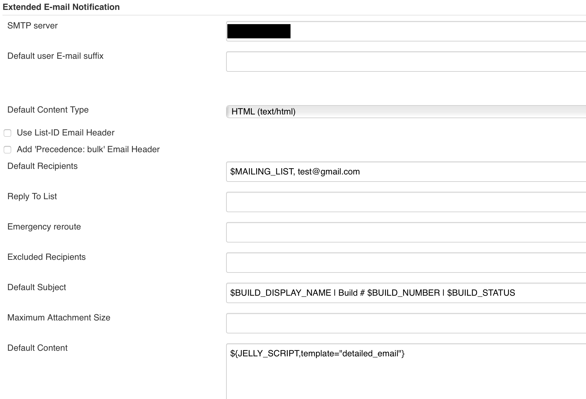
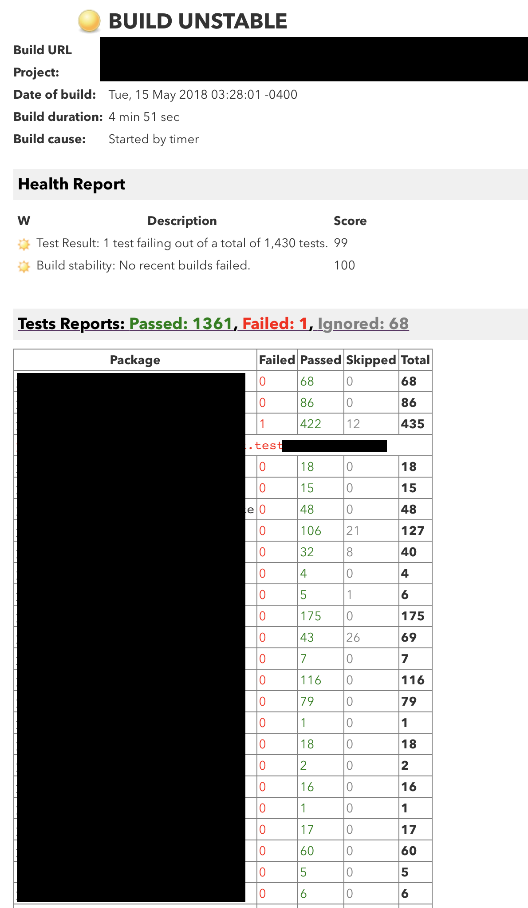
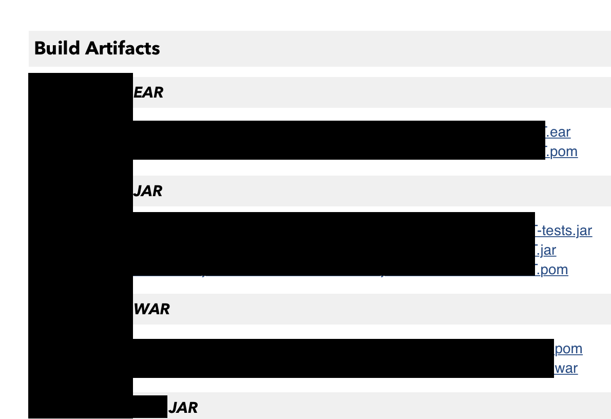

# jenkins-email-template
jelly template for jenkins email extension plugin

##### Installation:
 Copy **`detailed_email.jelly`** file on jenkins' `$JENKINS_HOME/email-templates/` directory. 
 
 For more details visit [Email-ext plugin wiki page.](https://wiki.jenkins.io/display/JENKINS/Email-ext+plugin#Email-extplugin-Jellycontent)

##### Usage:
- Use template name as `${JELLY_SCRIPT,template="detailed_email"}`

- Use email extension plugin in you jenkins job
- And get formatted email in your inbox:
    - Build Artifacts are direct download links to your jenkins.

